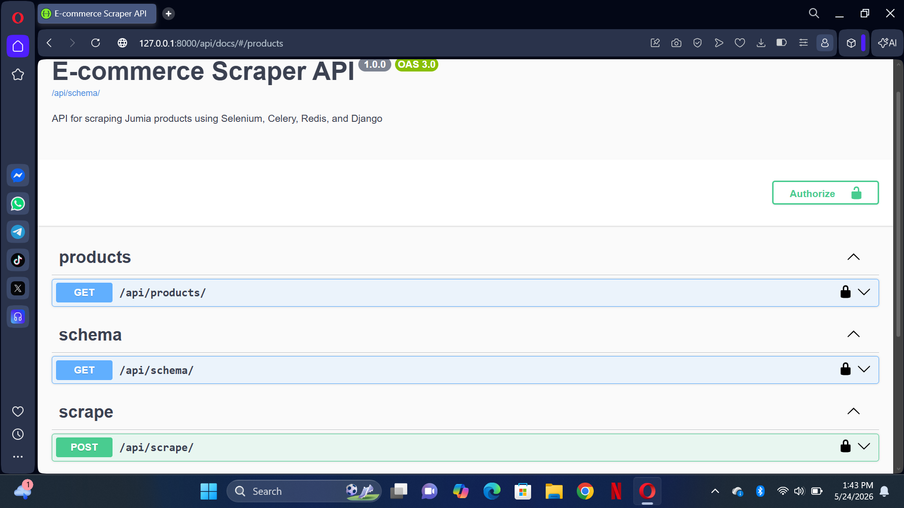
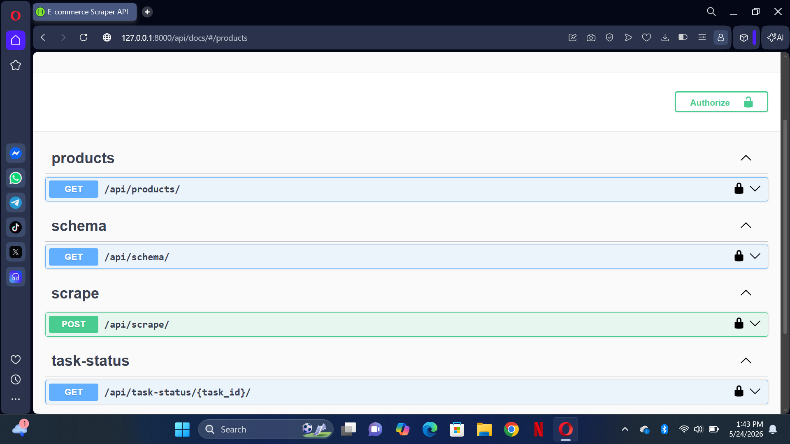
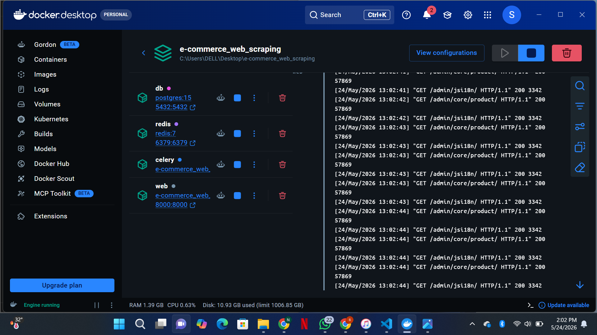
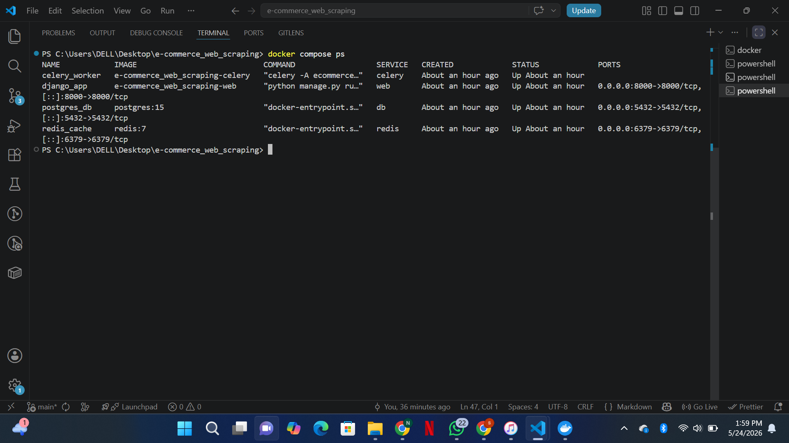
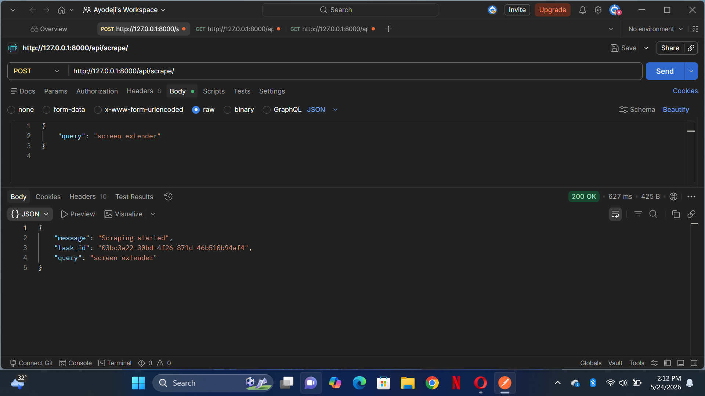
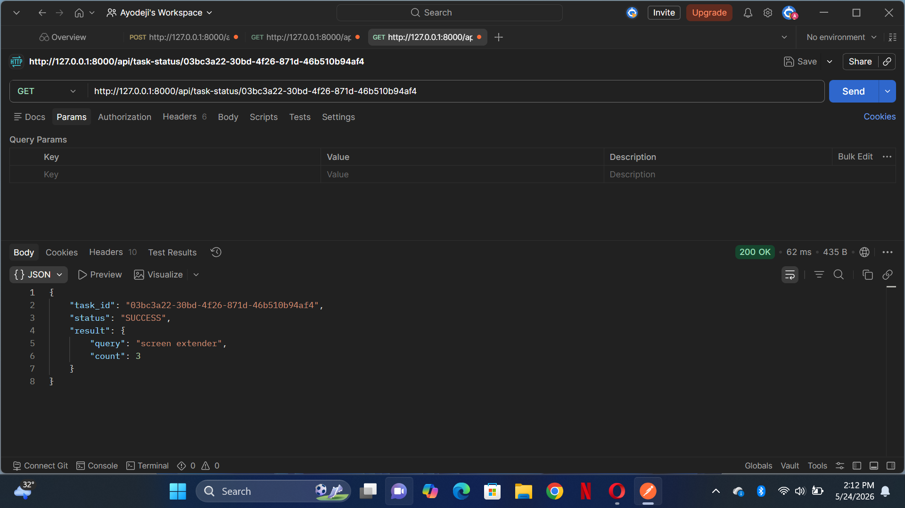
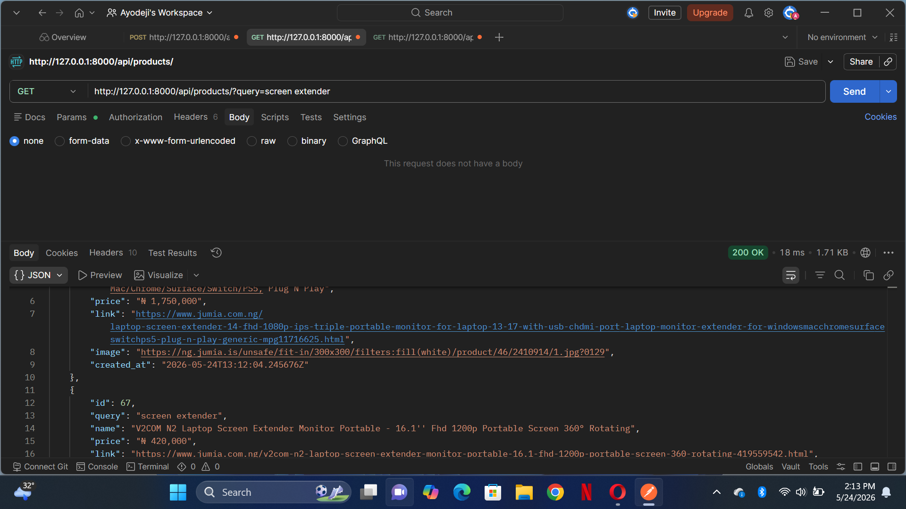
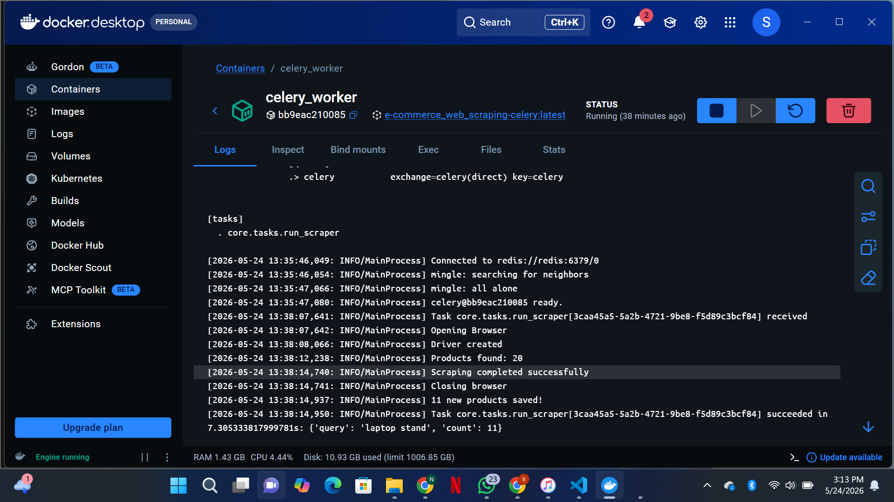

E-Commerce Web Scraping API

A Django-based e-commerce product scraping API that collects product data from Jumia using Selenium automation. The project uses Celery and Redis for background task processing, PostgreSQL for data storage, Docker for containerization, and Swagger for API documentation.

## Features

1. Scrape products from Jumia
2. Automatic cookie popup handling
3. REST API built with Django REST Framework
4. Background scraping tasks using Celery
5. Redis task broker
6. PostgreSQL database integration
7. Dockerized development environment
8. Swagger API documentation
9. Headless browser automation with Selenium
10. Product data persistence

## Tech Stack

1. Backend: Python, Django, Django REST Framework
2. Database: PostgreSQL
3. API Documentation:
   i. DRF Spectacular
   ii. Swagger UI
   iii. Postman
4. Web Scraping:
   i. Selenium
   ii. Chromium
   iii. ChromeDriver
5. Async Processing:
   i. Celery
   ii. Redis
6. DevOps:
   i. Docker
   ii. Docker Compose
7. Version Control: Git & GitHub

## Screenshots

## Swagger Documentation




## Docker Containers




## Scraped Products





## Celery Worker



## Project Structure

1. 'core/':
   i. API views
   ii. Celery task management
   iii. Product query services
   iv. Database models and serializers
2. 'scraper/':
   i. Selenium browser automation
   ii. Jumia scraping logic
   iii. Cookie popup handling
   iv. Headless Chromium configuration
3. 'ecommerce_web_scraping/':
   i. Django project settings
   ii. Celery configuration
   iii. URL routing
4. 'templates/':
   i. HTML templates for the web interface
5. 'docker-compose.yml':
   i. Multi-container Docker configuration
6. '.env':
   i. Environment variables configuration

## API Documentation
The API is documented using Swagger (OpenAPI).
After running the project locally, visit:
'/api/docs/' - Swagger UI to explore and test all available endpoints

## Installation

1. Clone the repository:

   ```
   git clone 
   cd e-commerce_web_scraping
   ```

2. Configure environment variables (.env)

3. Build and start Docker containers:

   ```
   docker compose up --build
   ```

4. Run database migrations:

   ```
   docker compose exec web python manage.py migrate
   ```

5. Access the application:

   ```
   http://127.0.0.1:8000/
   ```

6. Access Swagger API documentation:

   ```
   http://127.0.0.1:8000/api/docs/
   ```

## Purpose of the Project

This project was built to explore modern backend engineering workflows involving web scraping, asynchronous task processing, containerization, and REST API development.

The application simulates a production-style scraping pipeline where product data is collected from Jumia using Selenium automation, processed asynchronously with Celery and Redis, and stored in PostgreSQL through a Dockerized multi-service architecture.

The project demonstrates:

* Selenium browser automation
* Headless Chromium scraping inside Docker
* Asynchronous task queues with Celery
* Redis message broker integration
* REST API development with Django REST Framework
* PostgreSQL database integration
* Swagger/OpenAPI documentation
* Docker container orchestration
* Clean backend project structure

The goal was to strengthen backend engineering skills by building a real-world scraping system using modern development tools and scalable architecture patterns.


## Future Improvements

The following enhancements are planned for future versions of this project:

1. Replace Selenium with a faster headless scraping engine (e.g., Playwright) for improved performance and stability.
2. Add retry and failure handling for failed Celery tasks.
3. Implement task status tracking endpoint (PENDING, STARTED, SUCCESS, FAILURE).
4. Add pagination and filtering improvements for product API.
5. Introduce caching layer (Redis cache) to reduce repeated scraping requests.
6. Improve Docker setup with production-ready configuration (Gunicorn + Nginx).
7. Deploy the project using cloud services (AWS / Render / Railway).
8. Add authentication and rate limiting to protect API endpoints.
9. Implement scheduled scraping using Celery Beat.
10. Improve logging and monitoring (e.g., structured logs + Sentry).